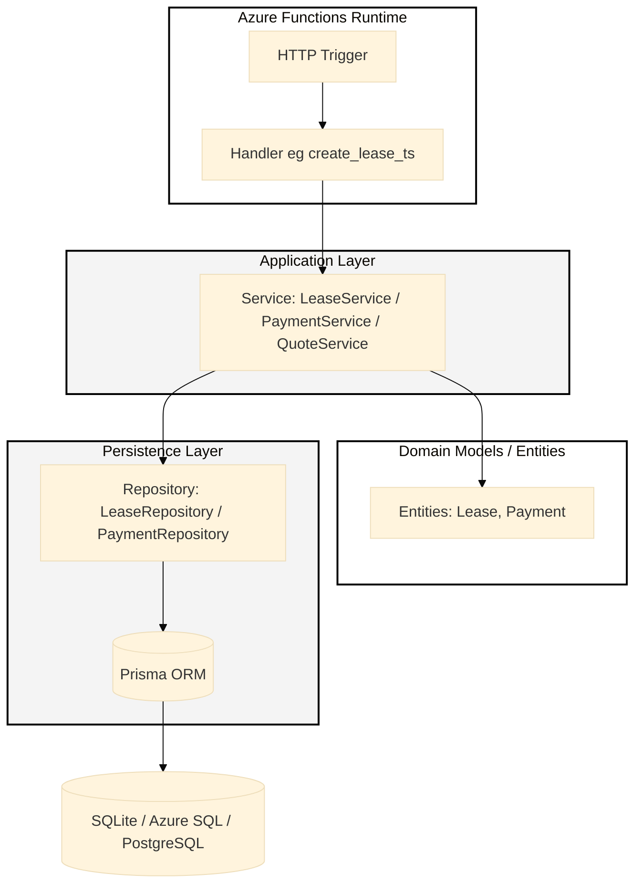

# Product Leasing System

A leasing management backend built with **Azure Functions**, **TypeScript**, and **Prisma ORM**.
It provides APIs for creating leases, generating payment schedules, and recording payments.

## 🚀 Overview

- **Tech Stack:** Azure Functions (v3), TypeScript, Prisma ORM, SQLite (local)
- **Testing:** Jest (unit + integration)

## ⚙️ Prerequisites

- Node.js v14
- npm
- Azure Functions Core Tools (v3)
- SQLite (for local development)

## 🧱  Endpoints

| Method | Route              | Description                       |
| ------ | ------------------ | --------------------------------- |
| `POST` | `/api/leases`      | Create a new lease                |
| `GET`  | `/api/leases/{id}` | Get lease details and balance     |
| `POST` | `/api/payments`    | Record a payment                  |
| `GET`  | `/api/quote`       | Generate lease quote and schedule |

## 📂 Project Structure

```yaml
functions/ 
	health-check 
	leases
	payments
	quote
src/
	handers/ # Entry points for each Azure Function
	domain/ # Type definitions and entity models
	application/ # Business logic and services
	persistence/ # Database repositories and Prisma mappers
	lib/ # Prisma client and utilities
	utils/ # General helper functions
tests/
	unit/ # Unit tests for services
	integration/ # Integration tests for API endpoints
```

## 🧭 Architecture Overview




## 🧩 Local setup

1. Clone and install dependencies

```bash
git init
git clone https://github.com/DMGoose/leasing-system.git
cd leasing-system
npm i
```

2. Generate Prisma client

```bash
npx prisma generate
```

3. Apply local migrations (SQLite)

```bash
npx prisma migrate dev
```

4. Prepare local settings (create `local.settings.json` and `env` at repo root)

`local.settings.json`

```json
{
  "IsEncrypted": false,
  "Values": {
    "AzureWebJobsStorage": "UseDevelopmentStorage=true",
    "FUNCTIONS_WORKER_RUNTIME": "node",
    "API_KEY": "local-dev-key",
    "DATABASE_URL": "file:./prisma/dev.db"
  }
}
```

`env`

```
DATABASE_URL="file:./prisma/dev.db"
API_KEY=local-dev-key
NODE_ENV=test
```

## 🏗️ Build & run locally

Build project:

```bash
npm run build
```

Start Functions runtime:

```bash
npm start
```

The API will be available at:

```
http://localhost:7071/api/
```

Notes

- Azure Functions Core Tools expects each function folder to contain a function.json and the script file (index.js). The project's build copies compiled JS into `dist/functions` and the start script points the runtime at that folder.
- If you encounter **"No job functions found."**, check:
  - Each folder under `dist/functions` contains both `function.json` and `index.js`
  - `host.json` exists at the root of `dist/`
  - You’re using Node.js 14

## 💾 Persistence (Prisma)

- **Local:** Uses SQLite by default (`prisma/schema.prisma`)
- **Production:** Use Azure Database for PostgreSQL, Azure SQL, or other managed DB.

  Prisma commands
    ```bash
    npx prisma generate  		# generate Prisma client
    npx prisma migrate dev       # local development
    npx prisma migrate deploy    # production
    ```

## 🧪 Testing

- Unit tests:

  ```
  npm run test:unit
  ```

- Integration tests:

  ```
  npm run test:integration
  ```

- All tests

  ```
  npm test
  ```

- Reset test DB (if needed):

  ```
  npm run test:resetdb
  ```

## 🔑 API Key

All API routes require an API key:

```
API_KEY=local-dev-key
```

You can set this in `.env` or `local.settings.json`.
